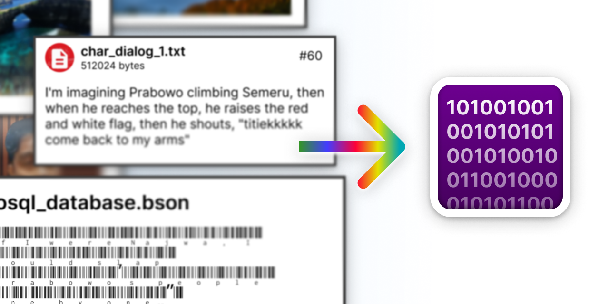

# Fukaskus Resource System



<p></p>

<div align="center" style="font-size:17px;font-weight:500;">Pack multiple files and directories into a single binary file, similar to Qt's RCC.</div>

<p></p>

Useful if you want to release your project and don't want your project's required assets file to be stored as-is in the executable folder, where they could easily edited or deleted by user, and also doesn't look aesthetically pleasing.

> No .h or any code will be generated. All file position and size information is stored in the binary.

# How to Use

This repo contains 3 projects.

- fukaskus
- libfukaskus-writer
- libfukaskus-reader

If you want to create a C++ project and want to use Fukaskus to pack files into a binary file, then use `libfukaskus-writer`. If you want to read a file in the binary, then use `libfukaskus-reader`. Both libraries and its documentation are stored in `libs/` folder.

Instead, if you only want to use Fukaskus in CLI without coding, then use `fukaskus`.

## Usage (`fukaskus`)

```
  -w, --write arg             Run in write mode, and the path of the
                              generated binary file
  -r, --read arg              Run in read mode, and the file path in the
                              binary file to be read
  -i, --input arg             Path of the input file (the json
                              specification if in write mode)
  -b, --bit arg               Write/read the binary file in 32-bit or
                              64-bit (32 for 32-bit, 64 for 64-bit). If in
                              write mode, use 64-bit if you want to pack
                              files larger than 4GB as long as your
                              filesystem supports 64-bit file (default: 32)
  -o, --read-output-path arg  Path of the output file if you want to output
                              the bytes being read from the binary file to disk,
                              not to stdout (used in read mode)
  -h, --help                  Print usage
```

### Write

You must create a [specification](#specification) first to tell what directories and files will be packed.

Use `-w` option to run in write mode, and after that input the path of the binary that will be generated. Then, use `-i` and after that input the path to the specification file.

Fukaskus will tell you if there's something wrong, or not telling anything if everything is running succesfully.

Example:
```
fukaskus -w binary.bin -i spec.json
```

### Read

Use `-r` option to run in read mode, and after that input the path of the file in the binary that you want to read. Then, use `-i` and after that input the path to the binary file.

By default, Fukaskus will output the bytes read from the file to stdout. If you want to output it to disk, use `-o` and then input the path that you want the file to be written to.

Example:
```
fukaskus -r assets/image.jpeg -i binary.bin -o image.jpeg
```

### Bit Mode (32-bit and 64-bit)

Fukaskus allows you to write/read file in 32-bit or 64-bit mode. This is useful if you want to write to a filesystem that doesn't support 64-bit file (like FAT32).

**If you want to pack files that are larger than 4GB, then you must use 64-bit mode**

Use `-b` to set bit mode, 32 for 32-bit and 64 for 64-bit (default is 32-bit).

## Specification

The files that will be packed are defined in a specification file. It's written in .json format.

```
[
    {
        "name": "", <- Name of the directory/file
        "children": [] <- The directory's children (only for directory)
    }
]
```

For example, we have a directory structure that looks like this:

```
- assets
--- image.jpeg
--- video.mp4

- extras
--- test.txt
--- documents
------- one.docx
------- two.docx
```

Then we can write the specification like this:

```
[
    {
        "name": "assets",
        "children": [
            {
                "name": "image.jpeg"
            },
            {
                "name": "video.mp4"
            }
        ]
    },
    {
        "name": "extras",
        "children": [
            {
                "name": "test.txt"
            },
            {
                "name": "documents",
                "children":
                [
                    {
                        "name": "one.docx"
                    },
                    {
                        "name": "two.docx"
                    },
                ]
            }
        ]
    }
]
```

# Building

Fukaskus is platform-independent. It doesn't use any platform-specific code, so you can build it for any operating system as long as there is C++17 compiler for that OS.

To build `fukaskus`, you can just go install all the dependencies required, setup CMake, and then run the CMake build command.

For `libfukaskus`, you can include the CMake project to your project whether by using `add_subdirectory` or anything that can make CMake find `libfukaskus`. For example on how to do it, see `fukaskus` CMakeLists.txt.

## Dependencies

`fukaskus` uses Conan as its package manager. For `libfukaskus`, just do whatever you want to install all of the required packages.

- `fukaskus`: cxxopts
- `libfukaskus-writer`: nlohmann_json
- `libfukaskus-reader`: No dependencies required


# How it Works

In the first byte of the binary file, there is a 1 byte flag to indicate whether the file is 32-bit or 64-bit.

After that, the entry table of the root directory is stored.

## Entry Table

All of the files and directories information (name, position, size) are stored in a Entry Table.

The entry table contains:

- (2 byte) Table length: how much entries are in the table.
- All of the entries in the table stored after the Table length.

Each entry contains:

- (1 byte) Is file flag: a flag to indicate whether the entry is a file/directory.
- (1 byte) Name size: the length of the name.
- (1-255 byte) Name: the name of the file/directory (max 255 characters)
- (4 byte/8 byte) Position: the position of the file data/directory entry (its size depend on whether the bin file is a 32-bit or 64-bit)
- (4 byte/8 byte) Size (only for file): the size of the file data (its size depend on whether the bin file is a 32-bit or 64-bit)

After the entry table, the binary data of all file entries will be stored in order.

If there is a directory entry in the table, all of its children entries will be stored after all of the binary data of the file entries (similar to FAT32).

# Todo

- Add compression feature to compress all of the files written to the binary file.
- Returns a stream for the file being read from `libfukaskus-reader` rather than returning the entire data buffer.
- Implement the 64-bit writer/reader (it's quite easy actually, but too lazy to do it)